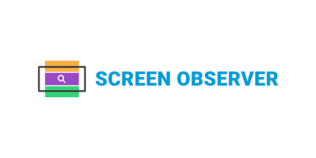

<h1 align="center">
  
</h1>

  <!-- <a href="https://discord.gg/ZegqCBr"></!-->
  <!--  -->
  <!--  -->
  <!--  -->
  
  

# Maintainers

<table>
  <tbody>
    <tr>
      <td align="center">
        
         
        <a href="https://github.com/simaodeveloper">Daniel Simão</a>
      </td>
    </tr>
  <tbody>
</table>

# Contributors

This project exists thanks to all the people who contribute.

You're free to contribute to this project by submitting [issues](https://github.com/simaodeveloper/screen-observer/issues) and/or [pull requests](https://github.com/simaodeveloper/screen-observer/pulls). This project is test-driven, so keep in mind that every change and new feature should be covered by tests.

This repository uses [standard style guide](https://github.com/standard/standard)

# License

MIT © Daniel Simão da Silva
